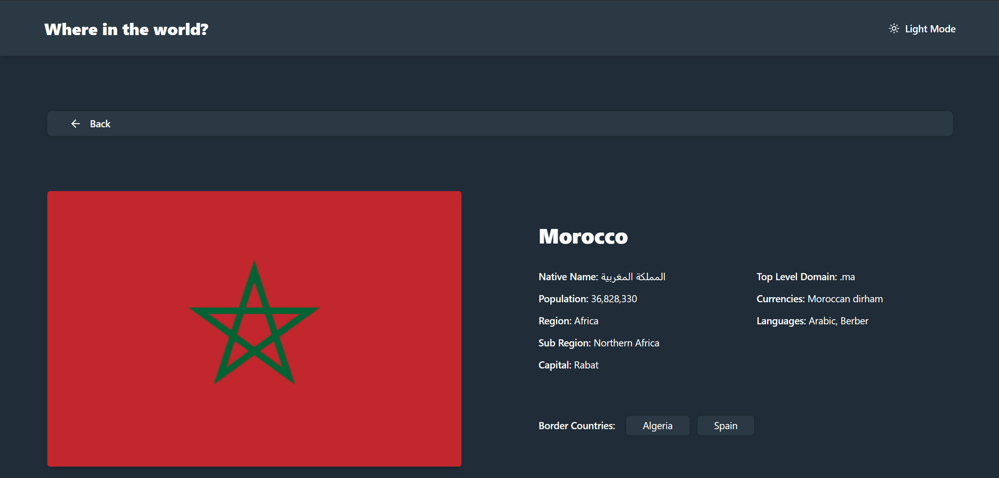

<div align="center">
<h1 align="center">Where in the World? 🌍 - REST Countries Explorer</h1>


> A responsive web application that integrates with the REST Countries API to display comprehensive information about countries across the globe, featuring a theme switcher, dynamic search, and advanced filtering.

<a href="https://amine4jh.github.io/countries-api-react/" target="_blank"><strong>➥ Live Demo</strong></a>

</div>

<br />

### Demo Screeshots

|             Dark Mode Home             |             Light Mode Home              |
| :------------------------------------: | :--------------------------------------: |
|  |  |

|              Dark Mode Details               |               Light Mode Details               |
| :------------------------------------------: | :--------------------------------------------: |
|  |  |

---

## ✨ Features

- **Global Catalog:** Fetch and display a comprehensive list of countries with robust **pagination** to handle large datasets smoothly.
- **Smart Search:** Instantly search for any country by its common name using the dynamic input field.
- **Region Filtering:** Filter the dashboard by specific geographic regions (Africa, Americas, Asia, Europe, Oceania) using a custom dropdown menu.
- **In-Depth Details:** Click on any country card to view a dedicated details page containing native names, population, domains, currencies, languages, and clickable border countries.
- **Theme Switcher:** Seamlessly toggle between custom Light and Dark modes to suit user preferences and reduce eye strain.
- **Optimized Performance:** Utilizes TanStack Query for efficient API data fetching, caching, and background synchronization, ensuring a snappy user experience without unnecessary loading states.

## 🛠️ Technologies Used

- **Frontend Framework:** [React](https://reactjs.org/)
- **Styling:** [Tailwind CSS](https://tailwindcss.com/)
- **Data Fetching & State:** [TanStack Query](https://tanstack.com/query/latest)
- **HTTP Client:** [Axios](https://axios-http.com/)
- **Countries API** [Rest Countries](https://restcountries.com)

---

## 🚀 Getting Started

Follow these steps to run the project locally on your machine.

### Prerequisites

- Node.js
- npm or yarn

### Installation

1.  **Clone the repository:**

    ```bash
    git clone https://github.com/Amine4jh/countries-api-react.git
    cd countries-api-react
    ```

2.  **Install dependencies:**

    ```bash
    npm install
    # or
    yarn install
    ```

3.  **Run the development server:**

    ```bash
    npm run dev
    # or
    yarn dev
    ```

4.  Open [http://localhost:5173](http://localhost:5173) with your browser to see the result.

---

<!-- ## ⚙️ Configuration

1.  Create a `.env` file in the root directory.
2.  Add your OpenWeather Token:
    ```env
    VITE_WEATHER_API_KEY=your_token_here
    VITE_WEATHER_BASE_URL=https://api.openweathermap.org/data/2.5/
    VITE_GEO_BASE_URL=http://api.openweathermap.org/geo/1.0/
    ```

--- -->

## 👤 Author

**Amine Ajaha**

GitHub: @Amine4jh

LinkedIn: [Amine Ajaha](https://www.linkedin.com/in/amineajaha/)

---

## 📄 License

This project is open source and available under the MIT License.
